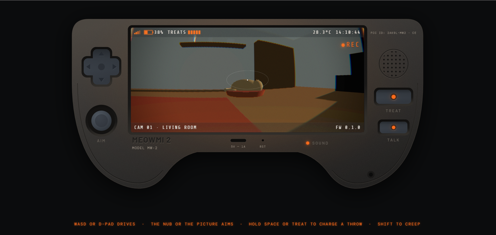

# MEOWMI 2

You are on holiday somewhere hot and Mediterranean. Back home your cat is alone in
your flat with a robot pet-camera — the kind that drives around and launches treats.
A motion notification arrives, you tap it, and you are live.

You try to get the cat to do something. The cat does not take instructions. The
robot does, but it only drives on the floor, it has no arms, and it is slow.

**Status: prototype.** The device, the robot and the treat launcher work. The cat is
scenery, and there are no levels yet.

---

## Running it

ES modules do not work over `file://`, so it has to be served. It cannot be opened
by double-clicking `index.html`.

Easiest way: install the **Live Server** extension in VS Code, then right-click
`index.html` → *Open with Live Server*.

There is no build step, no npm, and nothing to install. Three.js loads from a CDN
via an import map in `index.html`.

## Controls

| | |
|---|---|
| **WASD** or the d-pad | Drive |
| **The nub**, or moving the cursor over the picture | Aim — the further from centre, the faster it pans |
| **Space** or **TREAT** | Hold to charge a throw, release to fire |
| **Shift** | Creep, for lining up a shot |

The launcher is bolted to the camera, so you can only throw where you are already
looking. That constraint is the foundation of the whole design — everything
interesting later comes from not being able to watch the cat and aim somewhere else
at the same time.

---

## The files

| File | Job |
|---|---|
| `index.html` | The MEOWMI 2 chassis, drawn as one SVG. Three.js import map |
| `src/config.js` | **Every tunable number in the game.** Start here |
| `src/main.js` | Scene, lights, input, collision, the game loop |
| `src/room.js` | The flat, built from boxes. Each object is one line of data |
| `src/treats.js` | The launcher: ballistic treats, bouncing, landing preview |
| `src/post.js` | The lens — barrel distortion, chromatic aberration, tone mapping |
| `src/audio.js` | All sound, generated in the browser. No audio files |
| `src/style.css` | The device, and the overlays on the screen |
| `shots/` | One screenshot per version, named `fwX.Y.Z.png` after the FW number the OSD prints |

### If you want to change something

- **How it feels** — `src/config.js`. Robot speed, throw power, lens distortion,
  camera tilt limits. Nothing else should ever contain a magic number.
- **The room** — `src/room.js`. Furniture is a list; add a line, get an object.
- **How it looks** — `src/style.css` for the device, `src/post.js` for the picture.

---

## Notes to self

Things that were hard to work out and would be annoying to rediscover:

- **`fov` and `lens.barrel` are coupled.** The lens shader zooms in to keep the
  corners filled, so raising the barrel eats field of view and `fov` has to give it
  back.
- **Three skips tone mapping and sRGB encoding when rendering into a render
  target.** They only happen on the final pass to the canvas. `post.js` does both
  itself — without that, the picture comes out mysteriously dark.
- **SVG transforms work in user units, not pixels.** The nub cap has to be moved by
  a normalised vector times a constant, never by a pixel measurement.
- **`filter` and `backdrop-filter` on the same element** makes it its own stacking
  context and the frost silently stops working.
- **Web Audio: never start and stop oscillators.** Everything runs forever and only
  the volumes move, because starting and stopping clicks.

## Next

1. The cat reacts to treats — walks over, eats. *This is the fun test.* If messing
   with that for five minutes is not enjoyable, stop and rethink before building
   anything else.
2. Levels as data: a room, some objects, a goal. 60–90s, restartable.
3. The motion-clip timeline as the level select.
4. The battery timer — the socket is already in `CONFIG.battery`.
